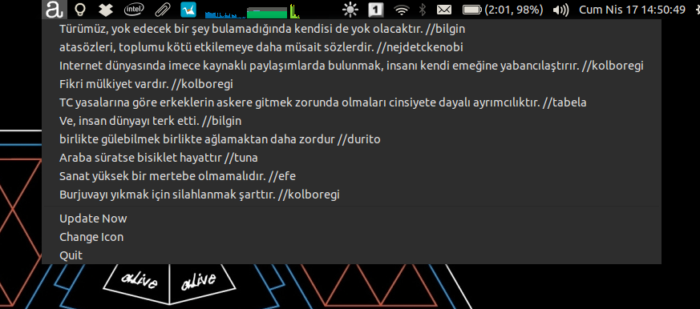

# Arguman.org için Ubuntu indikatörü

Repo'yu klonladıktan ve setup.py ile kurduktan sonra argumanorg_indicator komutu ile çalıştırabilirsiniz.
~/.config/autostart klasörüne sembolik bir link oluşturursanız otomatik te başlatabilirsiniz.

Geek Kalın.